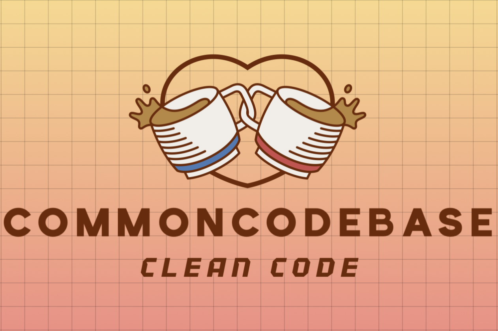

[](https://github.com/hasanaliozkan-dev/sfsgl/blob/main/LICENSE):


[
](https://visitor-badge.laobi.icu/badge?page_id=koraytacus/ReadmeContents)


# **Coding Exam Platform**

<p align="center">
  
</p>
<br><br><br><br><br><br><br><br><br>

## **Overview**
The Coding Exam Platform is a specialized local network-based system designed for university-level software and computer engineering students. It provides a structured and secure coding examination environment, similar to online coding challenge platforms like HackerRank, ensuring fairness and efficiency in programming assessments.

## **Key Features**

### **Instructor Capabilities**
- **Exam Setup:**
  - Uploads essential files before the exam:
    - **Assignment File:** Contains problem statements and exam instructions.
    - **Student List File:** Specifies the students participating in the exam.
    - **Pre-prepared Code File:** Includes starter code in the designated programming language (.py, .java, .c, etc.).
  - Configures key exam parameters:
    - **Exam Duration**
    - **Exam Name**
    - **Output Directory:** Defines the location where students' final submissions are stored with their student numbers.
- **Live Monitoring:**
  - Tracks students' progress in real-time.
  - Views the most recent code submissions and execution results of individual students.

### **Student Capabilities**
- **Secure Login:**
  - Authenticates using:
    - **Student Number**
    - **Full Name**
    - **Exam Password** (predefined by the instructor)
- **Coding Environment:**
  - **Left Panel:** Displays the assignment instructions.
  - **Right Panel:** Provides an integrated code editor for real-time programming.
- **Execution Environment:**
  - Runs code within a **Docker container**, dynamically selecting the appropriate compiler/interpreter based on the assigned programming language.
- **Submission System:**
  - Allows students to execute and test their code.
  - Final submissions are securely stored in the instructor-specified directory.

## **Technical Architecture**
- **Backend:** Handles user authentication, exam configuration, and file management.
- **Frontend:** Provides an interactive and intuitive coding interface.
- **Docker Integration:** Ensures an isolated and standardized execution environment for different programming languages.
- **Local Network Deployment:** Operates entirely within the university’s lab infrastructure, ensuring a controlled and secure examination setting without internet dependency.

## **Workflow**
1. The instructor sets up the exam, defining the necessary configurations and uploading required files.
2. Students log in securely using their credentials.
3. The exam interface loads, allowing students to write, execute, and test their code.
4. The instructor monitors students' progress and reviews real-time code execution results.
5. Students submit their final solutions, which are automatically stored in the designated output directory.
6. The exam concludes either upon time expiration or manual termination by the instructor.


### Prerequisites

-    
-    
-    


### Installation

1.  Clone the repository:

    ```bash
    git clone https://github.com/commoncodebase-ccb/safeCodeProvider.git
    ```

2.  Install dependencies:

    Python Installation: [Download Python](https://www.python.org/downloads/)

    Django Installation: [Download Django](https://www.djangoproject.com/download/)

    Docker Installation: [Download Docker](https://docs.docker.com/desktop/)


4.  Run the application:

   ```bash
   cd .\safeCodeProvider\
  ```
  ```bash
   py manage.py runserver 8000 --settings=safeCodeProvider.settings.teacher_settings
  ```

## **Potential Enhancements**
- **Automated Grading System:** Enables automatic evaluation based on predefined test cases.
- **Plagiarism Detection Mechanism:** Ensures academic integrity by identifying similar code submissions.
- **Expanded Language Support:** Adds compatibility for additional programming languages.


## **Main Contributers**

<table>
  <tr>
    <td align="center">
      <a href="https://github.com/hasanaliozkan-dev">
        
        <br />
        <b>Hasan Ali Özkan</b>
        <br />
        Researcher Assistant
      </a>
    </td>
    <td align="center">
      <a href="https://github.com/yarennoztekinn">
        
        <br />
        <b>Yaren Öztekin</b>
        <br />
        Full Stack Developer
      </a>
    </td>
    <td align="center">
      <a href="https://github.com/mazlumemregirgin">
        
        <br />
        <b>Mazlum Emre Girgin</b>
        <br />
        Full Stack Developer
      </a>
    </td>
    <td align="center">
      <a href="https://github.com/meliskirik">
        
        <br />
        <b>Melis Kırık</b>
        <br />
        Full Stack Developer
      </a>
    </td>
    <td align="center">
      <a href="https://github.com/Serdar1048">
        
        <br />
        <b>Serdar Dedebaş</b>
        <br />
        Full Stack Developer
      </a>
    </td>
    <td align="center">
      <a href="https://github.com/koraytacus">
        
        <br />
        <b>Koray Ürün</b>
        <br />
        Full Stack Developer
      </a>
    </td>
  </tr>
</table>


## **License**
This project is licensed under MIT License and **Anti-Capitalist Software License (ACSL)**.  
It is **strictly prohibited** to use this software for commercial purposes, profit-making ventures, or in support of capitalist organizations.  

However, contributions and modifications are **welcome** under the terms of this license.  

For full terms and conditions, see the [LICENSE](LICENSE) file or visit the official license page:  
🔗 [Anti-Capitalist Software License](https://anticapitalist.software)

For further inquiries or contributions, please submit a pull request or reach out via the project's repository.
